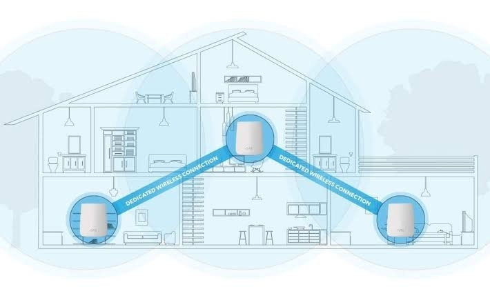
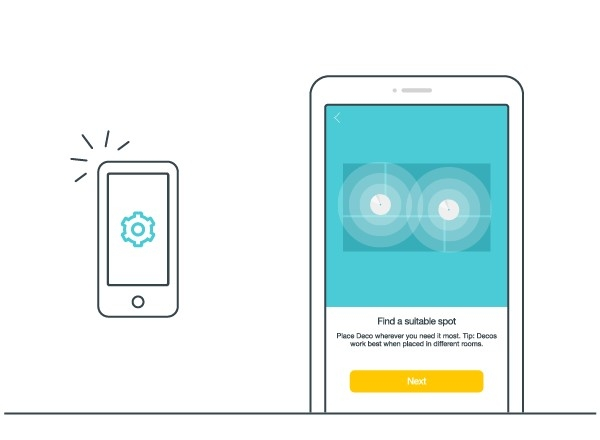

<html>
<head>
</head>
<body>
<link rel="stylesheet" href="style.css">
<h1>What is Mesh Wifi?</h1>

Mesh WiFi is a whole home WiFi system built to eliminate dead zones and to provide uninterrupted WiFi throughout your home. 

Mesh Routers enable devices in your network to have faster speeds, greater coverage, and a more reliable connection. While traditional routers broadcast WiFi from a single point, mesh WiFi systems have multiple access points. 

Mesh WiFi is built for all types of homes specifically mid size and large homes that have suffer from weak and incomplete Wifi coverage.Usually when you experience dead zones or slow wifi, you might opt into a range extender but find that it doesn’t provide you with the fastest speeds or connectivity throughout your home. Whereas mesh wifi routers are built to fully cover large homes up to 6,000 sq. ft., with two stories or more, interior brick walls, or an unusual layout. With more family members being home, a typical wifi router will have issues with maintaining strong internet access to all devices like phones, computers, or tvs. With multiple mesh nodes, everyone can easily connect more smart home devices simultaneously without slowing down your wifi bandwidth. 

They also represent a great option for people who are interested in a powerful WiFi system but don’t want to deal with the complicated setup and configuration that most regular routers come with.

Features of a Whole Home WiFi System  

 

<b>One Network for Your Entire Home</b>

Mesh technology is smart and intuitive, letting you stay online even if one of your mesh nodes fails. You can skip signing into a new network every time you go upstairs and stay connected to a single sturdy network no matter where you are.

</body>
</html>
